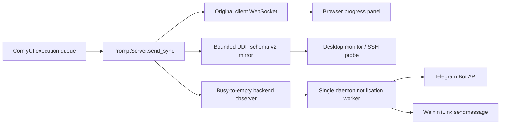

# ComfyUI Progress Bridge

<p align="center"><strong>English</strong> · <a href="README.zh-CN.md">简体中文</a></p>

[](https://github.com/Shenrui-Ma/ComfyUI-Progress-Bridge/actions/workflows/ci.yml)
[](pyproject.toml)
[](https://github.com/comfyanonymous/ComfyUI)
[](LICENSE)


Lightweight, privacy-first ComfyUI progress monitoring with a browser panel, optional desktop dock,
and UDP bridge. Sends Telegram and Weixin alerts when the queue finishes—**no extra workflow nodes
or workflow changes required**.

<br clear="right">

<p align="center">
  
</p>

## Demo video

<!-- GitHub replaces attachment links with native players and ignores video width attributes. -->
<div align="center">
<table><tr><td width="320">

https://github.com/user-attachments/assets/9431ad9d-0a61-4600-bb0c-75bd17643257

</td></tr></table>
</div>

<p align="center"><sub>37-second English v0.2.0 walkthrough.</sub></p>

## Highlights

| Area | Included functionality |
| --- | --- |
| ComfyUI integration | Import-time server extension, no graph nodes, no workflow mutation, idempotent `PromptServer.send_sync` wrapping |
| Browser panel | Automatically served with ComfyUI, queue/node/progress state, drag and keyboard movement, theme, opacity, scale, position reset, persistent settings |
| Desktop monitor | Frameless PyQt6 dock, multi-endpoint cards, local and SSH sources, simple/professional modes, themes, opacity, drag/restore, collapse, avatars |
| Progress model | Running and pending prompts, friendly node/stage resolution, authoritative queue snapshots, client-routed execution events |
| Languages | Simplified Chinese, English, Japanese, and Korean |
| Desktop alerts | Telegram, Weixin, QQ, completion audio, platform-specific test actions |
| Backend alerts | Telegram and Weixin, independently enabled and tested, triggered inside the ComfyUI process when a busy queue becomes empty |
| Audio | Disabled, built-in ding, or validated custom WAV |
| Remote monitoring | SSH probe with bounded reconnect/shutdown behavior; no remote agent service required |
| Packaging | Standard ComfyUI custom-node layout, PEP 621 wheel/sdist, browser assets, CLI entry point, GitHub Actions matrix |

## Installation

### ComfyUI custom-node installation

```bash
cd /path/to/ComfyUI/custom_nodes
git clone https://github.com/Shenrui-Ma/ComfyUI-Progress-Bridge.git
cd ComfyUI-Progress-Bridge
python -m pip install -r requirements.txt
```

Use the Python environment that launches ComfyUI. Restart the instance after installation.

Expected startup messages include:

```text
[ComfyUI Progress Bridge] schema 2 UDP 127.0.0.1:30999
[ComfyUI Progress Bridge] desktop launch requested
```

If backend notifications are configured:

```text
[ComfyUI Progress Bridge] backend notifications enabled
```

The repository works both as a direct `custom_nodes` checkout and as an installed Python package.
Direct-checkout loading is covered by an isolated import regression test.

### Headless server

Disable the native dock on servers without a desktop session:

```bash
COMFY_PROGRESS_BRIDGE_AUTOSTART=0 \
python main.py --listen 127.0.0.1 --port 8188
```

This does not disable the browser panel, UDP bridge, queue observer, or backend notifications.

### Optional standalone desktop command

```bash
comfyui-progress-desktop --show
```

For a deterministic UI preview without a running ComfyUI instance:

```bash
comfyui-progress-desktop --demo --show
```

## Backend queue-complete notifications

Backend notifications are part of this plugin. They do not require an agent framework, LLM,
desktop window, browser tab, or notification workflow node.

The trigger is mechanical:

```text
ComfyUI starts
    └── plugin installs a PromptServer.send_sync observer
            └── status.exec_info.queue_remaining > 0  → arm busy epoch
                    └── first subsequent queue_remaining == 0
                            └── enqueue exactly one completion notification
                                    └── daemon worker sends Telegram / Weixin
```

Important semantics:

- Initial zero does not notify.
- Positive-to-positive changes remain inside the same busy epoch.
- The first zero after a positive value notifies once and disarms the epoch.
- Repeated zero, malformed data, booleans, negative counts, and unrelated events are ignored.
- A later positive value starts a new epoch.
- Multiple short epochs are counted even while the notification worker is busy.
- Network work never runs in the `send_sync` callback.
- Notification failures never change the original return value or stop ComfyUI execution.

Telegram and Weixin have independent backend switches, targets, credentials, and test actions.
QQ remains desktop-only.

See [Backend notification setup](docs/backend-notifications.md) for local UI binding, headless server
configuration, credential permissions, and remote-host examples.

## Architecture



The original WebSocket call always runs first. The UDP mirror and notification observer are
best-effort side effects that fail open.

## Browser panel

The browser panel is served by ComfyUI from the plugin's `WEB_DIRECTORY` and loads automatically.
It requires no separate process or UDP forwarding.

The browser panel and the native dock shown above are separate interfaces. Both local and
remote ComfyUI use the same browser assets. See [local installation troubleshooting](docs/local-install-troubleshooting.md)
if the native dock does not appear or a browser still shows the old fixed panel.

It displays:

- connected ComfyUI endpoint;
- total remaining queue count;
- current node name from the current client's graph;
- sampler progress percentage;
- success, error, interruption, and idle states;
- mouse/touch dragging and keyboard arrow-key movement;
- system, dark, and light themes;
- configurable opacity and 80–125% scale;
- viewport-clamped position restore and one-click position reset;
- persistent appearance, position, and collapsed/expanded settings;
- Chinese, English, Japanese and Korean labels with automatic language selection;
- explicit connection state and the time of the last accepted update.

The panel listens to ComfyUI's existing client-routed WebSocket events, preserving the normal client
privacy boundary. It does not rebroadcast one user's prompt or execution details to all browsers.

## Native desktop monitor

The optional PyQt6 dock supports:

- multiple ComfyUI endpoints in one compact window;
- local loopback and SSH-monitored remote endpoints;
- endpoint-qualified state for identical prompt IDs across different servers;
- live node and sampler progress;
- workflow metadata-based friendly node names and stage labels;
- simple and professional display modes;
- dark, light, and system themes;
- configurable opacity, collapse state, screen position, and position reset;
- up to six PNG avatars with completion rotation;
- Chinese, English, Japanese, and Korean UI text;
- desktop Telegram, Weixin, and QQ notifications;
- disabled, built-in ding, and custom-WAV completion audio;
- explicit per-platform notification tests and audio tests;
- hidden-window monitoring: hiding the dock does not stop sources or alerts;
- bounded source shutdown so settings changes and exit do not freeze the UI.

Only quitting the desktop application stops its source and notification workers.

## Remote ComfyUI

### Browser access over SSH

Install the extension on the remote ComfyUI host and forward its existing HTTP port:

```bash
ssh -N -L 8188:127.0.0.1:8188 user@remote-server
```

Open `http://127.0.0.1:8188`. HTTP, the browser extension, and ComfyUI WebSocket traffic use the
same tunnel. No local plugin checkout is required for browser-only use.

### Desktop SSH source

The desktop monitor can launch the included bounded probe through ordinary SSH. The probe reads
authoritative queue snapshots on the remote machine and forwards compact NDJSON records to the local
desktop process. It does not install a persistent daemon or expose a new network listener.

## UDP schema v2

Every ComfyUI process sends compact best-effort datagrams to `127.0.0.1:30999` by default.

Each envelope contains:

- schema version;
- endpoint host and exact ComfyUI HTTP port;
- per-process UUID;
- monotonically increasing sequence number;
- observation timestamp;
- allowlisted event type and bounded data.

Example:

```json
{"schema":2,"endpoint":{"host":"127.0.0.1","port":8189},"instance_id":"70f12e92-a03d-4770-b080-1f90c9f1ed88","sequence":1,"observed_at":1787414400.0,"type":"executing","data":{"prompt_id":"abc","node":"4"}}
```

Mirrored event types:

- `executing`
- `progress`
- `execution_error`
- `execution_interrupted`
- `execution_success`

Eligible data fields:

- `prompt_id`
- `node`, `node_id`, `display_node`
- `value`, `max`
- `exception_message`, `node_type`

Binary previews, workflow inputs, prompts, model names, images, video, audio, and generated media are
never placed in UDP datagrams.

Run the example receiver with:

```bash
python examples/receive_progress.py
```

## Configuration

### Progress bridge

Set these before starting ComfyUI:

| Environment variable | Default | Purpose |
| --- | --- | --- |
| `COMFY_PROGRESS_BRIDGE_HOST` | `127.0.0.1` | Numeric IPv4 UDP destination; hostnames are rejected to keep DNS off the event path |
| `COMFY_PROGRESS_BRIDGE_PORT` | `30999` | Shared UDP listener port |
| `COMFY_PROGRESS_BRIDGE_ENDPOINT_HOST` | `127.0.0.1` | Host recorded in schema-v2 endpoint metadata |
| `COMFY_PROGRESS_BRIDGE_AUTOSTART` | enabled | Set to `0` to disable native desktop auto-launch |

### Backend notification configuration

Local desktop users can configure the independent **Backend queue-complete notifications** section
in the settings dialog and restart ComfyUI.

Headless hosts can point to an owner-private JSON file:

```bash
COMFY_PROGRESS_BRIDGE_BACKEND_CONFIG=/secure/path/backend-notifications.json \
COMFY_PROGRESS_BRIDGE_AUTOSTART=0 \
python main.py --port 8188
```

Tokens remain in a separate fixed-key `KEY=value` file. The parser never sources or evaluates it as
shell code. Telegram uses the official Bot API `sendMessage`; Weixin uses iLink `sendmessage` with a
persisted context token and never calls `getupdates`.

Outbound messaging still requires the ComfyUI host to have HTTPS access to the configured official
API. A blocked institutional network fails open: inference continues, but the external message cannot
be delivered until a permitted proxy or egress path exists.

Notification HTTPS requests support validated `HTTPS_PROXY`/`NO_PROXY` values and the native macOS
system HTTPS proxy.

## Security and privacy

- Backend notification mode is opt-in and disabled by default.
- Default monitoring destinations are loopback-only.
- No account system, cloud relay, analytics database, telemetry, or remote queue controls are added.
- Credentials and context tokens are kept outside workflow JSON and source control.
- Config, credential, and context files must be regular, current-user-owned, non-symlink files with
  mode 0600.
- Unknown backend JSON fields are rejected to prevent silent configuration typos.
- API requests use fixed HTTPS origins, bounded bodies and headers, no redirects, and one total
  monotonic deadline.
- User-visible errors and startup logs never include tokens, targets, context tokens, or raw API
  responses.
- The original `PromptServer.send_sync` is called before any monitoring or notification work, with
  positional/keyword arguments, return value, and client routing preserved.

## Robustness by the numbers

The following limits are enforced by code and regression tests rather than being deployment advice.

| Metric | Enforced value / behavior |
| --- | --- |
| Automated regression suite | **453 tests** as of 2026-09-05 |
| CI runtime matrix | Python **3.10, 3.11, 3.12, and 3.13** |
| UDP datagram ceiling | **8192 bytes** |
| Prompt ID bound | **256 characters** |
| Ordinary mirrored string bound | **1024 characters** |
| Mirrored error-text bound | **4096 characters** |
| Notification request/config/env ceiling | **1 MiB** |
| Notification response ceiling | **256 KiB** |
| HTTP response-header ceiling | **64 KiB** |
| Notification total timeout | Configurable **1–30 seconds**, enforced as one monotonic deadline |
| Weixin stale-context retry | At most **one** retry without the stale context token |
| Weixin rate-limit backoff | Bounded **1 s, 2 s, 4 s** schedule within the same total deadline |
| DNS behavior | One bounded daemon resolver with a single pending request slot |
| Queue completion deduplication | Exactly once per observed busy epoch |
| Worker blocking behavior | Completed epochs accumulate; they are not silently dropped |
| Backend installation | Idempotent under serial and concurrent installation attempts |
| Credential/config permissions | Owner-only **0600** files; app-created config directories use **0700** |
| Symlink/TOCTOU protection | `lstat` + `O_NOFOLLOW` + `fstat` device/inode verification |
| HTTP origin policy | HTTPS only, fixed official API hosts, redirects forbidden |
| Failure policy | Monitoring and notification errors are isolated from inference and WebSocket delivery |

Repository verification commands:

```bash
uv lock --check
uv run pytest -q
uv run ruff check .
uv run python -m compileall -q comfyui_progress_bridge tests
uv build
```

## Troubleshooting

| Symptom | Check |
| --- | --- |
| Plugin does not appear in startup imports | Confirm the complete repository directory is directly under `custom_nodes` and restart ComfyUI |
| Browser panel is missing | Hard-refresh the page and verify the plugin's `progress-panel.js` returns HTTP 200 |
| Native dock does not open | Check `COMFY_PROGRESS_BRIDGE_AUTOSTART`; headless hosts should leave it disabled |
| Backend reports disabled | Verify JSON schema, enabled platforms, 0600 permissions, ownership, credential path, and context path |
| Telegram/Weixin times out | Verify HTTPS egress or an allowed HTTPS proxy on the ComfyUI host |
| Weixin reports missing context | The configured peer must have a private persisted iLink context token |
| UDP receiver sees nothing | Confirm the receiver binds the configured shared port and no other process owns it |
| Remote desktop source reconnects | Verify SSH authentication, remote Python, probe path, and the ComfyUI loopback port |

Monitoring and notification errors are intentionally recoverable and must not stop inference.

## Update and uninstall

Update the custom node:

```bash
cd /path/to/ComfyUI/custom_nodes/ComfyUI-Progress-Bridge
git pull --ff-only
python -m pip install -r requirements.txt
```

Restart only after the target ComfyUI queue is empty.

To uninstall, stop that ComfyUI instance and remove the plugin directory. Desktop settings and
backend credentials are stored separately in the user configuration directory so they can be
reviewed or removed independently.

## Development

```bash
git clone https://github.com/Shenrui-Ma/ComfyUI-Progress-Bridge.git
cd ComfyUI-Progress-Bridge
uv sync --extra dev
uv run pytest -q
uv run ruff check .
uv build
```

The CI workflow repeats the full test, lint, compile, and build gates on every push and pull request
for all supported Python versions.

## Project boundaries

This project deliberately does not add:

- branding-only or placeholder workflow nodes;
- prompt submission, cancellation, or queue-clearing controls;
- prompt/model/media forwarding;
- cloud relays, accounts, telemetry, or historical analytics;
- LAN listeners by default;
- an LLM or external agent runtime dependency.

## Comfy Registry

The repository follows the standard ComfyUI custom-node layout and includes PEP 621 metadata.
Registry publisher metadata will be added after the project owner creates the corresponding Comfy
Registry Publisher ID.

## License

Code is released under the [MIT License](LICENSE).

The Silver Wolf sticker is decorative fan art generated for this README. This project is not
affiliated with or endorsed by HoYoverse.
