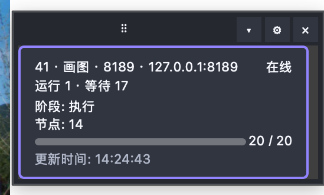

# ComfyUI Progress Bridge

A lightweight [ComfyUI](https://github.com/comfyanonymous/ComfyUI) extension that shows live execution progress directly in the ComfyUI browser page and mirrors the same compact events to an optional native desktop monitor over UDP.

It is designed for desktop companions, status docks, dashboards, and other observers that need the real active node and sampler progress without hijacking the WebSocket used by the client that submitted the prompt.

<p align="center">
  
</p>
<p align="center"><sub>Transparent desktop dock with live queue, node, and sampler progress.</sub></p>

## Why this exists

ComfyUI normally sends `executing` and `progress` WebSocket events to the submitting client's `client_id`. A second WebSocket opened by an external monitor therefore may see the queue but miss node-level events.

This extension preserves ComfyUI's original delivery and emits a second, best-effort UDP copy on loopback:

```text
ComfyUI PromptServer.send_sync
        ├── original WebSocket delivery (unchanged)
        └── compact UDP event → external visual monitor
```

## Features

- Mirrors `executing`, `progress`, `execution_error`, `execution_interrupted`, and `execution_success`
- Preserves the original `PromptServer.send_sync` return value and client routing
- Sends only a compact allowlist of useful fields
- Adds a zero-configuration floating progress panel to the ComfyUI browser page
- Works through an ordinary SSH port forward or WebSocket-capable reverse proxy
- Uses loopback by default; no network service is exposed
- Automatically starts one native PyQt6 desktop progress dock when ComfyUI imports the extension
- Optionally sends queue-drained Telegram/Weixin notifications directly from the ComfyUI backend
- Is idempotent and fail-open: monitoring or desktop-launch errors never stop ComfyUI execution
- Provides a server extension only; it intentionally adds no workflow node

## Installation

```bash
cd /path/to/ComfyUI/custom_nodes
git clone https://github.com/Shenrui-Ma/ComfyUI-Progress-Bridge.git
cd ComfyUI-Progress-Bridge
python -m pip install -r requirements.txt
```

ComfyUI Manager installs `requirements.txt` automatically; the final command is only needed for a
manual clone and must use the same Python environment that runs ComfyUI.

Restart that ComfyUI instance. The browser panel is loaded with the ComfyUI page—no workflow node,
separate local program, UDP forwarding, or first inference is required. On a desktop system,
importing the custom node also starts the optional native progress dock automatically. Its startup
log should include, for example:

```text
[ComfyUI Progress Bridge] schema 2 UDP 127.0.0.1:30999
[ComfyUI Progress Bridge] desktop launch requested
```

The importing ComfyUI HTTP port is passed to the dock automatically, including custom ports such
as `8189`; this launch-time endpoint does not overwrite saved desktop settings. A secure per-endpoint
lock prevents repeated imports from opening duplicate dock windows while allowing different local
ComfyUI ports to have their own monitors.

For a headless server, or when a separately managed monitor is preferred, disable automatic UI
startup before launching ComfyUI:

```bash
COMFY_PROGRESS_BRIDGE_AUTOSTART=0 python main.py --port 8188
```

Every ComfyUI process sends to the shared loopback listener on UDP port `30999`.
The schema-v2 envelope carries the exact ComfyUI HTTP port and a process instance UUID,
so ports such as `8189` and `9189` and identical prompt IDs cannot collide.

> Each running ComfyUI process must be restarted once after installation. Wait for `running=0` and `pending=0` before restarting a production instance.

## Browser panel

The floating panel appears automatically near the upper-right corner of every ComfyUI page served
by an installation containing this extension. It shows the connected server, queue count, current
node, sampler percentage, and terminal state. The arrow button collapses the details and remembers
that choice in the browser.

The panel listens to ComfyUI's existing client-routed WebSocket events. It therefore follows the
same privacy boundary as the normal ComfyUI interface instead of republishing one user's progress
or error details to every connected browser. Queue status is used to return the panel to idle when
an API-submitted job does not emit a client-specific terminal event.

### Local ComfyUI

1. Install the extension in the local ComfyUI `custom_nodes` directory.
2. Restart ComfyUI.
3. Open or refresh the ComfyUI page. The browser panel is ready immediately.
4. The native PyQt6 dock also starts by default. Set `COMFY_PROGRESS_BRIDGE_AUTOSTART=0` before
   starting ComfyUI if only the in-browser panel is wanted.

### Remote ComfyUI through SSH

Install and restart the extension **on the remote server**, preferably with native desktop startup
disabled on a headless host:

```bash
COMFY_PROGRESS_BRIDGE_AUTOSTART=0 python main.py --listen 127.0.0.1 --port 8188
```

Forward the normal ComfyUI HTTP port from the local computer:

```bash
ssh -N -L 8188:127.0.0.1:8188 user@remote-server
```

Then open `http://127.0.0.1:8188` locally. The plugin JavaScript is served through the same mapping,
runs in the local browser, and receives progress through ComfyUI's existing WebSocket. No plugin,
Python environment, PyQt6 process, SSH probe, or UDP port is needed on the local computer.

For a reverse proxy instead of SSH, proxy both HTTP and WebSocket upgrades for the ComfyUI origin.

## Backend queue-complete notifications

Telegram and Weixin can notify directly from the ComfyUI Python process when the whole queue changes
from busy to empty. This path does not require the desktop window to remain visible, Hermes or another
gateway to be running, an LLM call, a browser, or a workflow node.

For a local desktop installation, open the progress dock settings and use the separate **Backend
queue-complete notifications** section. Telegram and Weixin have independent enable switches,
targets, and test buttons. Select an owner-private credential env file containing only the required
token keys, save, and restart ComfyUI. Backend mode is disabled by default and QQ is intentionally
not available there.

For a headless or remote ComfyUI host, provision an owner-private backend JSON and credential file
on that host and select it with `COMFY_PROGRESS_BRIDGE_BACKEND_CONFIG` before launch. See
[Backend notification setup](docs/backend-notifications.md) for local and remote examples, file
permissions, Weixin context-token requirements, and queue semantics.

## Receive events

Run the included receiver:

```bash
python examples/receive_progress.py
```

Then submit a normal ComfyUI workflow. The receiver prints newline-delimited JSON such as:

```json
{"schema":2,"endpoint":{"host":"127.0.0.1","port":8189},"instance_id":"70f12e92-a03d-4770-b080-1f90c9f1ed88","sequence":1,"observed_at":1787414400.0,"type":"executing","data":{"prompt_id":"abc","node":"4"}}
{"schema":2,"endpoint":{"host":"127.0.0.1","port":8189},"instance_id":"70f12e92-a03d-4770-b080-1f90c9f1ed88","sequence":2,"observed_at":1787414400.1,"type":"progress","data":{"prompt_id":"abc","node":"24","value":9,"max":12}}
```

An external monitor can join `prompt_id` and `node` with the workflow graph returned by ComfyUI's `/queue` endpoint to display friendly stages such as model loading, sampling, VAE decode, and saving.

## Configuration

Environment variables must be set before starting ComfyUI:

- `COMFY_PROGRESS_BRIDGE_HOST`: numeric IPv4 UDP destination, default `127.0.0.1` (hostnames are rejected to prevent DNS work on the event path)
- `COMFY_PROGRESS_BRIDGE_PORT`: explicit UDP destination port, default `30999`
- `COMFY_PROGRESS_BRIDGE_ENDPOINT_HOST`: numeric IPv4 host recorded in `endpoint.host`, default `127.0.0.1`

Older releases derived a separate UDP port from each HTTP port. Schema v2 intentionally
replaces that behavior with one shared listener. Existing deployments that require a fixed
legacy destination can set `COMFY_PROGRESS_BRIDGE_PORT` explicitly, but receivers must read
the schema-v2 envelope.

Example:

```bash
COMFY_PROGRESS_BRIDGE_PORT=41000 python main.py --port 8189
```

Notification HTTPS requests honor validated `HTTPS_PROXY`/`NO_PROXY` settings and the native macOS
system HTTPS proxy. Redirects remain disabled and API origins are fixed to the supported official
hosts.

## Event contract

Only these event types are mirrored:

- `executing`
- `progress`
- `execution_error`
- `execution_interrupted`
- `execution_success`

Only these data fields are eligible for forwarding:

- `prompt_id`
- `node`, `node_id`, `display_node`
- `value`, `max`
- `exception_message`, `node_type`

Binary previews, workflow inputs, prompts, model names, images, and generated media are not forwarded.
Each datagram is capped at 8192 bytes. `prompt_id` is limited to 256 characters, ordinary
forwarded strings to 1024 characters, and error text to 4096 characters.

## Security and compatibility

- The default destination is loopback. Setting a non-loopback destination can expose prompt IDs, node IDs, progress, and error messages to that network destination.
- UDP is intentionally best-effort. A dropped progress packet does not affect inference.
- The browser panel preserves ComfyUI's normal WebSocket client routing. The separate UDP mirror
  still contains the compact allowlist below and should remain on loopback unless explicitly secured.
- The implementation wraps an internal ComfyUI method, `PromptServer.send_sync`. The wrapper is small and covered by tests, but upstream internal API changes may require an update.
- This repository targets Python 3.10+ and current ComfyUI releases.

## Development

```bash
uv sync --extra dev
uv run pytest -q
uv run ruff check .
```

## Comfy Registry

The repository follows the standard ComfyUI custom-node layout and includes PEP 621 metadata. Registry-specific `[tool.comfy]` publisher metadata is intentionally not guessed; it should be added after the owner creates a Publisher ID at [Comfy Registry](https://registry.comfy.org/).

## License

MIT
