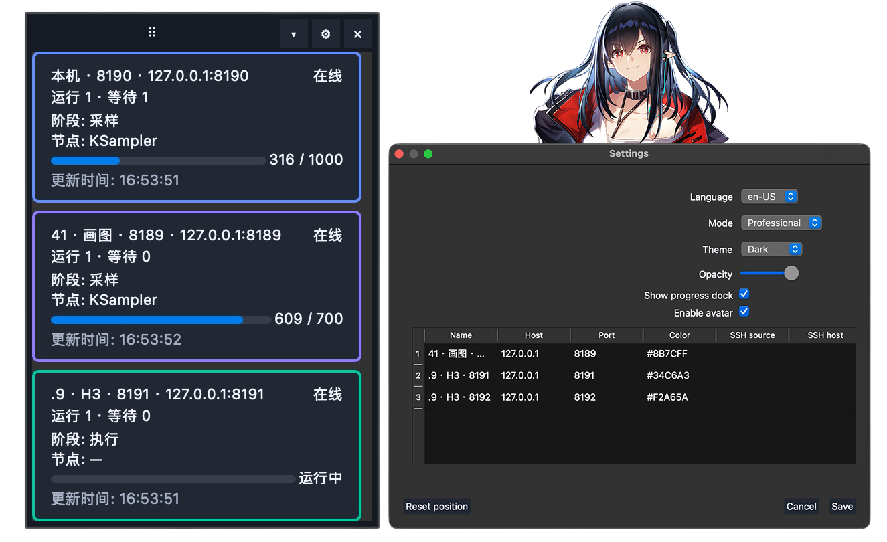
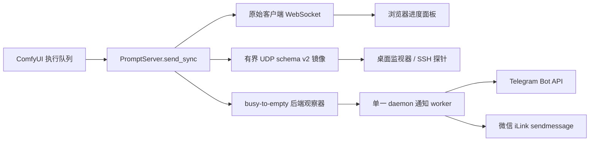

# ComfyUI Progress Bridge

<p align="center"><a href="README.md">English</a> · <strong>简体中文</strong></p>

[](https://github.com/Shenrui-Ma/ComfyUI-Progress-Bridge/actions/workflows/ci.yml)
[](pyproject.toml)
[](https://github.com/comfyanonymous/ComfyUI)
[](LICENSE)

轻量、隐私优先的 ComfyUI 进度插件，提供浏览器面板、可选桌面悬浮窗和 UDP 事件桥。
支持同时监控多个 ComfyUI 进程，兼容本地与远程实例。
队列完成后可直接发送 Telegram/微信提醒，**无需额外工作流节点，不改动工作流**。

<p align="center">
  
</p>

## 演示视频

<!-- GitHub 会将附件链接替换为原生播放器，并忽略 video 标签的宽度属性。 -->
<div align="center">
<table><tr><td width="320">

https://github.com/user-attachments/assets/2162ce3f-f9c2-4dfa-8ec7-2e9775b76271

</td></tr></table>
</div>

<p align="center"><sub>37 秒中文功能演示。</sub></p>

## 功能概览

| 模块 | 已包含功能 |
| --- | --- |
| ComfyUI 集成 | 导入时启动的服务端扩展、零图节点、零工作流修改、幂等包装 `PromptServer.send_sync` |
| 浏览器面板 | 随 ComfyUI 自动加载、队列/节点/进度状态、鼠标与键盘移动、主题、透明度、缩放、位置重置、设置持久化 |
| 桌面监视器 | 无边框 PyQt6 悬浮窗、多端点卡片、本地与 SSH 来源、简洁/专业模式、主题、透明度、拖动与位置恢复、折叠、头像 |
| 进度模型 | 运行中与等待中的任务、友好节点/阶段解析、权威队列快照、客户端路由的执行事件 |
| 语言 | 简体中文、英语、日语、韩语 |
| 桌面提醒 | Telegram、微信、QQ、完成提示音、各平台独立测试动作 |
| 后端提醒 | Telegram 与微信独立启用和测试，由 ComfyUI 进程在忙碌队列变空时触发 |
| 音频 | 关闭、内置提示音或经过校验的自定义 WAV |
| 远程监控 | 带有界重连/关闭行为的 SSH 探针；无需远程常驻 Agent 服务 |
| 打包发布 | 标准 ComfyUI 自定义节点布局、PEP 621 wheel/sdist、浏览器资源、CLI 入口、GitHub Actions 矩阵 |

## 安装

### 安装为 ComfyUI 自定义节点

```bash
cd /path/to/ComfyUI/custom_nodes
git clone https://github.com/Shenrui-Ma/ComfyUI-Progress-Bridge.git
cd ComfyUI-Progress-Bridge
python -m pip install -r requirements.txt
```

请使用启动 ComfyUI 的同一个 Python 环境安装依赖。安装后重启对应 ComfyUI 实例。

正常启动日志包含：

```text
[ComfyUI Progress Bridge] schema 2 UDP 127.0.0.1:30999
[ComfyUI Progress Bridge] desktop launch requested
```

如果已经配置后端通知，还会显示：

```text
[ComfyUI Progress Bridge] backend notifications enabled
```

仓库既支持直接放入 `custom_nodes`，也支持安装为 Python 包。直接 checkout 加载方式已有隔离导入
回归测试保护。

### 无头服务器

没有桌面环境的服务器应关闭原生悬浮窗：

```bash
COMFY_PROGRESS_BRIDGE_AUTOSTART=0 \
python main.py --listen 127.0.0.1 --port 8188
```

这不会关闭浏览器面板、UDP 桥、队列观察器或后端通知。

### 可选的独立桌面命令

```bash
comfyui-progress-desktop --show
```

没有运行 ComfyUI 时，可使用确定性的 UI 演示模式：

```bash
comfyui-progress-desktop --demo --show
```

## 后端队列完成通知

后端通知属于本插件自身，不需要 Agent 框架、LLM、桌面窗口、浏览器标签页或通知工作流节点。

触发过程完全机械化：

```text
ComfyUI 启动
    └── 插件安装 PromptServer.send_sync 观察器
            └── status.exec_info.queue_remaining > 0  → 当前 busy epoch 进入 armed 状态
                    └── 后续第一次 queue_remaining == 0
                            └── 仅入队一次完成通知
                                    └── daemon worker 发送 Telegram / 微信
```

关键语义：

- 初始值为 0 时不通知。
- 正数变为其他正数仍属于同一个 busy epoch。
- 正数之后第一次出现 0 时通知一次，并解除 armed 状态。
- 重复的 0、畸形数据、布尔值、负数和无关事件都会被忽略。
- 之后再次出现正数时开启新的 epoch。
- 即使通知 worker 正忙，多个短 epoch 也会被累计，不会静默丢失。
- 网络请求永远不会在 `send_sync` 回调线程执行。
- 通知失败不会改变原始返回值，也不会阻断 ComfyUI 执行。

Telegram 与微信拥有独立的后端开关、目标、凭据和测试动作。QQ 仅保留在桌面模式。

本地 UI 绑定、无头服务器配置、凭据权限和远程主机示例见
[后端通知设置](docs/backend-notifications.md)。

## 架构



原始 WebSocket 调用始终最先执行。UDP 镜像和通知观察器都是 fail-open 的尽力而为副作用。

## 浏览器面板

浏览器面板通过插件的 `WEB_DIRECTORY` 由 ComfyUI 自动提供，无需单独进程或 UDP 转发。

浏览器面板与上方截图中的原生桌面窗是两种界面。本地和远程 ComfyUI 使用相同的浏览器资源。
如果桌面窗未启动或仍显示旧版固定面板，请参阅[本地安装排查](docs/local-install-troubleshooting.md)。

它会显示：

- 当前连接的 ComfyUI 端点；
- 剩余队列总数；
- 从当前客户端工作流取得的节点名称；
- 采样进度百分比；
- 成功、错误、中断和空闲状态；
- 鼠标/触控拖动与键盘方向键移动；
- 跟随系统、深色和浅色主题；
- 可配置透明度和 80–125% 缩放；
- 受视口边界保护的位置恢复和一键位置重置；
- 可持久化的外观、位置和折叠/展开设置；
- 中、英、日、韩四语言及自动语言选择；
- 明确的连接状态与最后收到有效更新的时间。

面板监听 ComfyUI 现有的客户端路由 WebSocket 事件，因此保持原有客户端隐私边界。它不会把
某位用户的提示词或执行细节重新广播给所有浏览器。

## 原生桌面监视器

可选的 PyQt6 悬浮窗支持：

- 在一个紧凑窗口中监视多个 ComfyUI 端点；
- 本地 loopback 和通过 SSH 监视的远程端点；
- 以端点限定状态，避免不同服务器上的相同 prompt ID 冲突；
- 实时节点和采样进度；
- 基于工作流元数据的友好节点名和阶段标签；
- 简洁与专业显示模式；
- 深色、浅色和跟随系统主题；
- 可配置透明度、折叠状态、屏幕位置和位置重置；
- 最多六张 PNG 头像，并可在完成时轮换；
- 中文、英语、日语和韩语界面；
- 桌面端 Telegram、微信、QQ 通知；
- 关闭、内置提示音和自定义 WAV 完成音频；
- 各平台显式通知测试和音频测试；
- 窗口隐藏后继续监控：隐藏悬浮窗不会停止数据源或提醒；
- 有界数据源关闭，避免应用设置或退出时冻结 UI。

只有退出桌面应用才会停止其数据源和通知 worker。

## 远程 ComfyUI

### 通过 SSH 访问浏览器

在远程 ComfyUI 主机安装扩展，然后转发现有 HTTP 端口：

```bash
ssh -N -L 8188:127.0.0.1:8188 user@remote-server
```

在本机打开 `http://127.0.0.1:8188`。HTTP、浏览器扩展和 ComfyUI WebSocket 会共用这条
隧道。仅使用浏览器面板时，本机不需要插件 checkout。

### 桌面 SSH 数据源

桌面监视器可以通过普通 SSH 启动随项目提供的有界探针。探针在远程读取权威队列快照，
再向本地桌面进程发送紧凑的 NDJSON 记录。它不会安装持久 daemon，也不会暴露新的网络监听器。

## UDP schema v2

每个 ComfyUI 进程默认向 `127.0.0.1:30999` 发送紧凑的、尽力而为的数据报。

每个 envelope 包含：

- schema 版本；
- 端点主机和准确的 ComfyUI HTTP 端口；
- 每进程 UUID；
- 单调递增的 sequence；
- 观察时间戳；
- allowlist 事件类型和有界数据。

示例：

```json
{"schema":2,"endpoint":{"host":"127.0.0.1","port":8189},"instance_id":"70f12e92-a03d-4770-b080-1f90c9f1ed88","sequence":1,"observed_at":1787414400.0,"type":"executing","data":{"prompt_id":"abc","node":"4"}}
```

镜像事件类型：

- `executing`
- `progress`
- `execution_error`
- `execution_interrupted`
- `execution_success`

允许的数据字段：

- `prompt_id`
- `node`、`node_id`、`display_node`
- `value`、`max`
- `exception_message`、`node_type`

二进制预览、工作流输入、提示词、模型名、图片、视频、音频和生成媒体永远不会进入 UDP 数据报。

运行示例接收器：

```bash
python examples/receive_progress.py
```

## 配置

### 进度事件桥

请在启动 ComfyUI 前设置：

| 环境变量 | 默认值 | 用途 |
| --- | --- | --- |
| `COMFY_PROGRESS_BRIDGE_HOST` | `127.0.0.1` | 数字 IPv4 UDP 目标；拒绝主机名，避免在事件路径执行 DNS |
| `COMFY_PROGRESS_BRIDGE_PORT` | `30999` | 共享 UDP 监听端口 |
| `COMFY_PROGRESS_BRIDGE_ENDPOINT_HOST` | `127.0.0.1` | 写入 schema-v2 端点元数据的主机 |
| `COMFY_PROGRESS_BRIDGE_AUTOSTART` | 启用 | 设为 `0` 可关闭原生桌面自动启动 |

### 后端通知配置

本地桌面用户可在设置窗口中配置独立的 **后端队列完成通知**，保存后重启 ComfyUI。

无头主机可指向仅所有者可读的 JSON 文件：

```bash
COMFY_PROGRESS_BRIDGE_BACKEND_CONFIG=/secure/path/backend-notifications.json \
COMFY_PROGRESS_BRIDGE_AUTOSTART=0 \
python main.py --port 8188
```

Token 保存在单独的固定键 `KEY=value` 文件中，解析器永远不会 source 或执行其中的 shell
内容。Telegram 使用官方 Bot API `sendMessage`；微信使用带持久化 context token 的 iLink
`sendmessage`，且永远不会调用 `getupdates`。

消息发送仍要求 ComfyUI 主机能够通过 HTTPS 访问对应官方 API。机构网络阻断时会 fail-open：
推理继续正常运行，但在获得允许的代理或出口前无法发送外部消息。

通知 HTTPS 请求支持经过校验的 `HTTPS_PROXY`/`NO_PROXY`，以及 macOS 原生系统 HTTPS 代理。

## 安全与隐私

- 后端通知是显式 opt-in，默认关闭。
- 默认监控目标仅限 loopback。
- 不增加账号系统、云中继、分析数据库、遥测或远程队列控制。
- 凭据和 context token 不进入工作流 JSON 或源码仓库。
- 配置、凭据和 context 文件必须是当前用户拥有、非 symlink、权限 0600 的普通文件。
- 未知后端 JSON 字段会被拒绝，避免拼写错误被静默忽略。
- API 请求使用固定 HTTPS 来源、有界 body/header、禁止重定向和单一 monotonic deadline。
- 用户可见错误和启动日志不会包含 token、目标、context token 或原始 API 响应。
- 原始 `PromptServer.send_sync` 总是最先执行，并保留位置/关键字参数、返回值和客户端路由。

## 量化鲁棒性指标

下列数值由代码和回归测试强制执行，而不是仅供参考的部署建议。

| 指标 | 强制值 / 行为 |
| --- | --- |
| 自动化回归测试 | 截至 2026-09-05 共 **453 项测试** |
| CI Python 矩阵 | Python **3.10、3.11、3.12、3.13** |
| UDP 数据报上限 | **8192 bytes** |
| Prompt ID 上限 | **256 字符** |
| 普通镜像字符串上限 | **1024 字符** |
| 镜像错误文本上限 | **4096 字符** |
| 通知请求/配置/env 文件上限 | **1 MiB** |
| 通知响应体上限 | **256 KiB** |
| HTTP 响应头上限 | **64 KiB** |
| 通知总超时 | 可配置 **1–30 秒**，以单一 monotonic deadline 强制执行 |
| 微信 stale context 重试 | 最多 **一次**去除 stale context token 的重试 |
| 微信限流退避 | 在同一总 deadline 内执行有界 **1 秒、2 秒、4 秒**退避 |
| DNS 行为 | 一个有界 daemon resolver，最多容纳一个待处理请求 |
| 队列完成去重 | 每个已观察到的 busy epoch 恰好一次 |
| Worker 阻塞行为 | 已完成 epoch 会累计，不会静默丢失 |
| 后端安装 | 串行与并发安装均保持幂等 |
| 凭据/配置权限 | 文件仅允许所有者访问，权限 **0600**；应用创建的配置目录使用 **0700** |
| Symlink/TOCTOU 防护 | `lstat` + `O_NOFOLLOW` + `fstat` 设备号/inode 复核 |
| HTTP 来源策略 | 仅 HTTPS、固定官方 API 主机、禁止重定向 |
| 故障策略 | 监控和通知错误与推理、WebSocket 投递隔离 |

仓库验证命令：

```bash
uv lock --check
uv run pytest -q
uv run ruff check .
uv run python -m compileall -q comfyui_progress_bridge tests
uv build
```

## 故障排查

| 现象 | 检查项 |
| --- | --- |
| 启动导入列表中没有插件 | 确认完整仓库目录直接位于 `custom_nodes` 下，然后重启 ComfyUI |
| 浏览器面板没有显示 | 强制刷新页面，并确认插件 `progress-panel.js` 返回 HTTP 200 |
| 原生悬浮窗没有启动 | 检查 `COMFY_PROGRESS_BRIDGE_AUTOSTART`；无头主机应保持关闭 |
| 后端显示 disabled | 检查 JSON schema、平台开关、0600 权限、所有权、凭据路径和 context 路径 |
| Telegram/微信超时 | 检查 ComfyUI 主机的 HTTPS 出口或允许使用的 HTTPS 代理 |
| 微信提示缺少 context | 配置的目标必须拥有私有、持久化的 iLink context token |
| UDP 接收器没有事件 | 检查接收器是否绑定配置的共享端口，以及端口是否被其他进程占用 |
| 远程桌面来源反复重连 | 检查 SSH 认证、远程 Python、探针路径和 ComfyUI loopback 端口 |

监控和通知错误有意设计为可恢复，不能阻断推理。

## 更新与卸载

更新自定义节点：

```bash
cd /path/to/ComfyUI/custom_nodes/ComfyUI-Progress-Bridge
git pull --ff-only
python -m pip install -r requirements.txt
```

请仅在目标 ComfyUI 队列为空后重启。

卸载时，停止对应 ComfyUI 实例并移除插件目录。桌面设置和后端凭据保存在独立的用户配置
目录中，可以单独检查或删除。

## 开发

```bash
git clone https://github.com/Shenrui-Ma/ComfyUI-Progress-Bridge.git
cd ComfyUI-Progress-Bridge
uv sync --extra dev
uv run pytest -q
uv run ruff check .
uv build
```

CI 会在每次 push 和 pull request 时，针对全部受支持 Python 版本重复执行测试、lint、编译和
构建门禁。

## 项目边界

本项目有意不添加：

- 仅用于品牌展示或占位的工作流节点；
- 提交、取消或清空队列的控制；
- 提示词、模型或媒体转发；
- 云中继、账号、遥测或历史分析；
- 默认 LAN 监听器；
- LLM 或外部 Agent 运行时依赖。

## Comfy Registry

仓库遵循标准 ComfyUI 自定义节点布局，并包含 PEP 621 元数据。项目所有者创建对应的
Comfy Registry Publisher ID 后，再补充 Registry publisher 元数据。

<p align="center">
  
</p>

## 许可证

代码采用 [MIT License](LICENSE)。

银狼贴纸是为本 README 生成的装饰性同人图。本项目与 HoYoverse 无隶属或背书关系。
